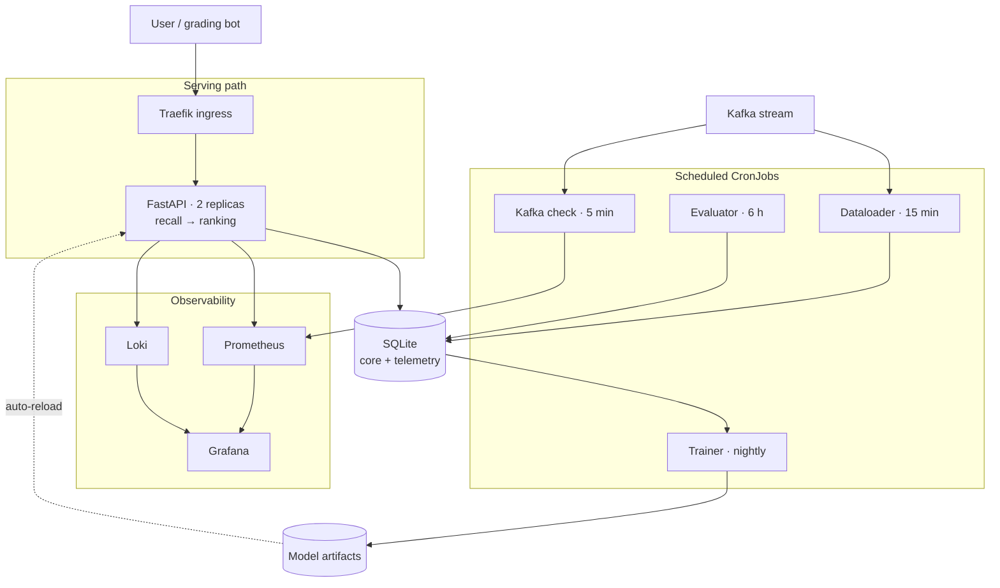

Infrastructure and MLOps lead in a 5-person CMU team (17-645). Operated a movie recommender serving a simulated 1M-user streaming service across dev and prod Kubernetes environments, with Helm charts, a FastAPI inference service, GitHub Actions CI/CD, and Prometheus, Grafana, and Loki monitoring. Cut recommendation timeouts from 15-20% of requests to 3.3%.

<!--more-->

## Architecture

The whole system runs on a single k3s VM, split into dev and prod namespaces off one Helm chart with separate values files. A Kafka stream feeds batch ingestion; the serving path stays independent of it so that ingestion problems never take down recommendations.

Model updates are zero-downtime: the trainer CronJob writes a new artifact to a shared volume, and the API reloads it by watching the file's modification time, degrading gracefully if the artifact is briefly missing mid-write.

## Making it fast

Recommendations were timing out on 15-20% of requests, falling back to non-personalized results. Two separate causes turned up.

The **ranking stage** compared each candidate movie against every user who had liked it — for popular movies, thousands. Worst case ran past 30,000 similarity operations per request. Capping users scanned per movie, skipping users with fewer than 2 shared movies, and trimming the candidate set brought that to roughly 1,500 operations, a **95% reduction**.

The **first request to each pod** took about 2 seconds, because the model loaded lazily. Preloading it during pod startup and adding a `startupProbe` meant pods only receive traffic once the model is ready, which removed the cold-start penalty entirely.

Measured in dev over a 60-request sample after the change:

| Metric | Before | After |
|---|---|---|
| Timeout rate | 15-20% | 3.3% |
| Cold-start latency | ~2,000ms | <100ms |
| P50 latency | — | 3ms |
| P95 latency | — | 100ms |
| Requests under 100ms | — | 93% |

## Monitoring

Four signals, each on its own cadence:

- **Service availability** — a CronJob scans the Kafka stream every 5 minutes for recommendation events and pushes an up/down gauge through the Prometheus Pushgateway, so the internal metric matches how the service is graded externally
- **Model accuracy** — an online evaluator computes hit-rate every 6 hours by joining recommendations against subsequent watches
- **Operating cost** — per-request movie license cost written to a telemetry table with running totals kept for O(1) dashboard reads
- **Data drift** — unique users and movies per 2-hour window as a leading indicator, plus schema validation on every external movie-API response

Alerts are deliberately narrow: only conditions that mean something is actually broken, such as no healthy API pods or a failed CronJob, routed to the infrastructure owner rather than the whole team. Cost and hit-rate are watched on dashboards instead, since neither is actionable at alerting timescales.

## Delivery

- Authored 92% of the CI/CD pipeline commits, across 8 GitHub Actions workflows
- Per-component Docker builds with git-SHA image tags on GHCR, chained so an image build triggers the matching Helm deployment
- Unit tests with coverage reporting gate every pull request; Grafana dashboards are synced from version control rather than edited in the UI

## Team scope

Drift detection and the core A/B testing logic were owned by teammates, and I owned the security analysis in the final milestone. My primary scope was the delivery pipeline, Kubernetes operations, and observability.
